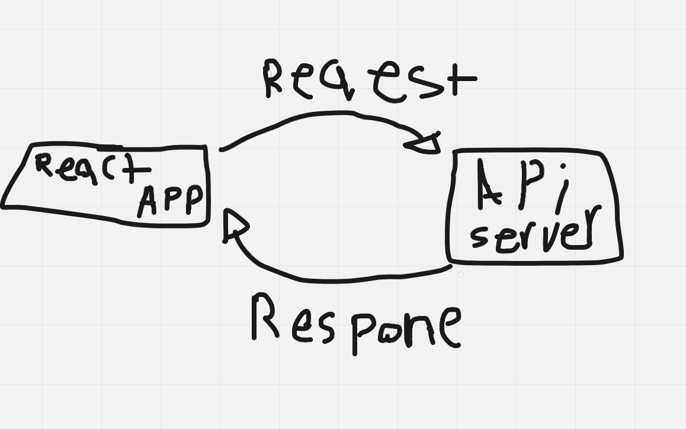

Overview
Getting Started
-Creating a new project as a react applicaiton.

Creating the main components of your project (APP.JS , HEADER.JS , MAIN.JS ,FOOTER.JS)
APP.js will include all of the other components .
The header will include the Main name of the applicaiton .
The main will contain all of the functionality of the application such as : A-Taking inputs from the user B-Contacting with the api to send and receive requests C-handling the erros using handling methods such as (try and catch) D-Displaying The info after recieving it from the API
Architecture
.it uses js, html and css as the main technologis .
.Uses the react library as the main library of the whole website .
.Used an libray called Axios Which is a Javascript library used to make HTTP requests from node.
.Using LocationIQ which provides flexible enterprise-grade location based solutions.
And here is the request-response cycle of the application :

---
Change Log
Successfully imported the react library.
Successfully Implemented the LocationIQ in the main component .
Successfully Implemented a form which will take an input from the user .
Successfully Implemented the Axios Library and its ready to use .
Successfully Implemented all of the components in the APP.js
28/8/2022 6pm - Application now has a fully-functional express server, with a GET route for the location resource.
 ---
 Time Analysis :
Name of feature: Connecting with the API______________________

Estimate of time needed to complete: 20 mins_

Start time: 5:40_

Finish time: _6:00

Actual time needed to complete: 20 mins___

Name of feature: Try and Catch____________________

Estimate of time needed to complete: 5mins___

Start time: 6:00

Finish time: 6:05___

Actual time needed to complete: 5 mins_

Name of feature: Reading and filtering the Data______________________

Estimate of time needed to complete: 10 mins___

Start time: 6:05___

Finish time: 6:30___

Actual time needed to complete: 25 mins___

//
//